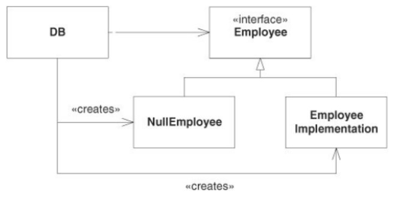

# Hackenge 01

------

### IF977- Engenharia de Software - Equipe 01

- Franklin Amaral Nunes dos Santos Filho
- Gustavo Prazeres Paz do Nascimento
- Thales Brederodes Montarroyos Candido
- Thiago Conte Rocha
- Thiago de Holanda Carvalho

**Desafio Proposto:**

Em uma entrevista dada ao site InformIT, em 2009, por ocasião dos 15 anos do lançamento da primeira edição do GoF, três dos autores do livro mencionaram que — se tivessem que lançar uma segunda edição do trabalho — provavelmente manteriam os padrões originais e incluiriam alguns novos, que se tornaram comuns desde o lançamento da primeira edição, em 1994.

Um dos novos padrões que eles mencionaram na entrevista é chamado de Null Object. Estude e explique o funcionamento e os benefícios desse padrão de projeto. Para isso, você vai encontrar diversos artigos na Web.

- Mas se preferir consultar um livro, uma boa referência é o Capítulo 25 do livro Agile Principles, Patterns, and Practices in C#, de Robert C. Martin e Micah Martin.

- Ou então o refactoring chamado Introduce Null Object do livro de Refactoring de Martin Fowler.

------

\# **Metodologia Utilizada**
Para a resolução desse hackenge, a equipe criou um documento no Google Docs em uma pasta compartilhada. Cada um dos integrantes realizou suas pesquisas relacionadas ao tema e, posteriormente em um dia determinado pela equipe, todos se juntaram em uma reunião online para preencher o Docs. Após o fim, um dos integrantes inseriu as informações no README do Hackenge, fez o commit e o push para o repositório remoto no GitHub!

------

# **Null Object**

Esse objeto substitui a verificação de um *return null*, que é propenso a dar erros e no geral, visualmente feio. Para não haver a necessidade de utilizar essa forma, podemos criar um objeto nulo, que, essencialmente, contém todos os métodos e variáveis do objeto “não-nulo”, exceto que seus valores são nulos e fazem nada além de uma verificação. 

Os benefícios de usar esse padrão, são que possui uma consistência maior nos resultados, contrário ao *return null,* sempre retornará uma instância do objeto procurado, e também é melhor de lê-lo.

Usando um exemplo do livro Princípios de Padrões e Práticas Ágeis em C#, é possível demonstrar em código, como funciona. 

A seguir, é um exemplo do código testando um valor *null*:

```c#
Employee e = DB.GetEmployee("Bob");
if (e != null && e.IsTimeToPay(today)) 
    e.Pay(); 
```

E, a seguir, segue um exemplo utilizando o objeto nulo:

```c#
Employee e = DB.GetEmployee("Bob");
if (e.IsTimeToPay(today))
    e.Pay();
```

E uma imagem da estrutura:



Nesse caso, o código não checa por valor nulo, é recebido o objeto *GetEmployee*, caso “Bob” não exista, *IsTimeToPay* é retornado falso, e caso exista, o código funciona normalmente!
