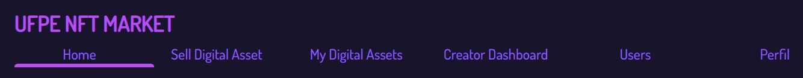
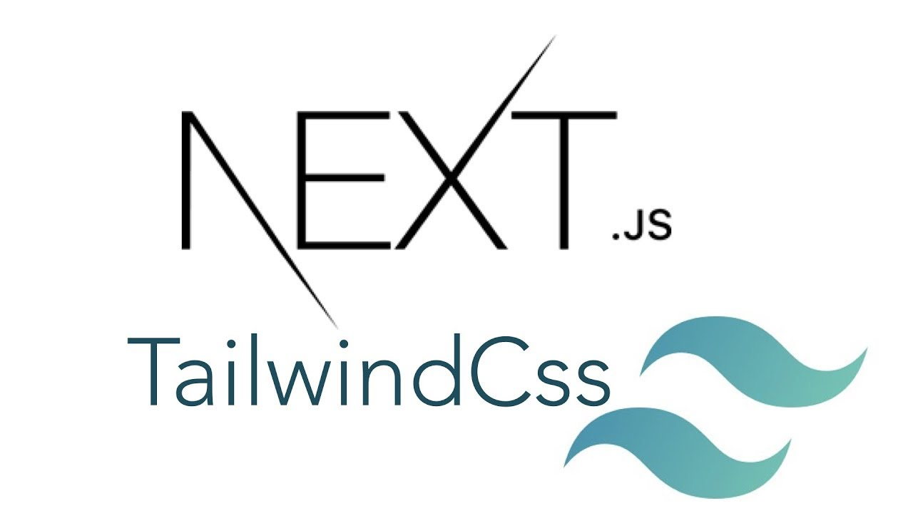
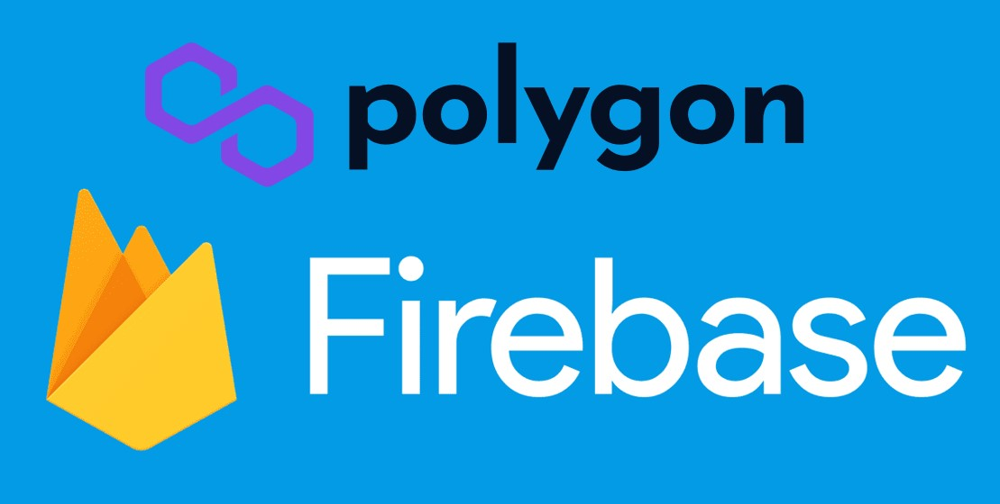
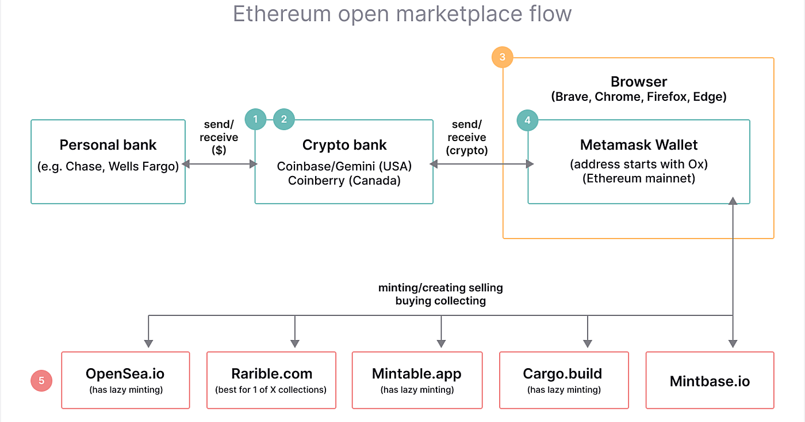

# UFPE NFT Market

## Iteração 1



------

### IF977- Engenharia de Software - Equipe 01

- Franklin Amaral Nunes dos Santos Filho
- Gustavo Prazeres Paz do Nascimento
- Thales Brederodes Montarroyos Candido
- Thiago Conte Rocha
- Thiago de Holanda Carvalho

------

## O escopo do projeto

#### O que são NFT`s?

NFT (non-fungible token) é um token que representa um **ativo exclusivo**. Ele é uma espécie de certificado digital que garante a **originalidade e exclusividade** de produtos físicos ou digitais. Ao contrário das criptomoedas que podem ser substituídas por outras de equivalente valor, os NFTs não são substituíveis. Eles são únicos e não há um igual ao outro.

Isso é possível graças à tecnologia blockchain, sistema que permite que os proprietários dos NFT`s comprovem a autenticidade e a procedência do ativo. Por meio dessa abordagem, é possível criar a escassez digital, que vai proporcionar valor ao token. Os NFTs podem representar uma versão digital de praticamente qualquer item, como textos, quadros, músicas, cards colecionáveis, jogos, etc.

#### Como comprar e vender NFT`s?

Os NFTs são negociados em **mercados de NFT**, também conhecidos como marketplaces. Esses locais reúnem criadores e colecionadores para criar e negociar os NFT's. As vendas são feitas em preço fixo ou na forma de leilões. Neste caso, é preciso dar um lance vencedor para assumir a propriedade do NFT. Dada a grande popularização dos NFT`s e sua tendência a crescimento, este projeto busca a implantação de um marketplace NFT que vai permitir que os usuários comprem e vendam seus NFT's.

------

## Canvas de Proposta de Valor do Projeto

a

------

## Canvas do Modelo de Negócio

a

------

## Canvas do Modelo de Projeto

a

------

## Arquitetura do Sistema

| FrontEnd: Next.js e Tailwind | Backend: Polygon e Firebase |
| ---------------------------- | --------------------------- |
|                |                |

#### Processo de Criação de um NFT




## Histórias de Usuários Iniciais

```
Como artista, eu gostaria de criar um NFT com minha arte para que ela seja única e tenha um valor digital insubstituível.
```

```
Como artista, eu gostaria de criar um NFT com minha arte para que ela possa ser vendida a outros usuários integrantes da blockchain e eu consiga ter um lucro com meu trabalho desenvolvido.
```

```
Como como colecionador de NFTs, eu gostaria de ter a posse de itens raros em meu dashboard para ganhar status e reconhecimento de outros colecionadores.
```

```
Como investidor, eu gostaria de comprar e vender NFT's de forma estratégica visando o retorno do capital investido.
```


## Mockup da Interface Final

<print do mockup no trello>

------

## Metodologia Planejada

- #### Versionamento do Código por meio do Git e repositório público no GitHub

- #### Controle de atividades planejadas, em progresso e realizadas por meio de Quadro Kanban no Trello

- #### Realização de reuniões semanais por entre os integrantes da equipe utilizando o Discord

- #### Apresentar ao professor orientador relatórios semanais do andamento das atividades em desenvolvimento

------

# Postmorten da Iteração 1

| Início da Iteração | Término da iteração |
| ------------------ | ------------------- |
| 11/10/2021         | 24/11/2021          |


### O que estava planejado
| Atividade                                                    | Atribuição |
| ------------------------------------------------------------ | ---------- |
| Definição de escopo do projeto                               | `@todos`   |
| Criação de Canvas de Proposta de Valor do Projeto            | `@todos`   |
| Criação de Canvas do Modelo de Negócio                       | `@todos`   |
| Criação de Canvas do Modelo de Projeto                       | `@todos`   |
| Definição da Arquitetura do Sistema                          | `@todos`   |
| Criação das Histórias de Usuários Iniciais                   | `@todos`   |
| Montagem de Mockup da Interface Final                        | `@todos`   |
| Definição e finalização da metodologia de trabalho (Criação de repositórios, quadros e cartões kanban) | `@todos`   |
| Reunião semanal todos os sábados no Discord da Equipe        | `@todos`   |

### O que foi e  o que não foi feito

* Todas as atividades planejadas para essa iteração foram realizadas!

### Planejado para próxima iteração
- Criação do planejamento no formato **GQM**;
- Modelo ER;
- Criação dos primeiros testes automatizados funcionando;
- Realização do Postmortem da Iteração 2.

### Lições aprendidas
* Conceitos teóricos sobre NFT`s;
* Criação de Histórias de Usuários;
* Organização do trabalho para que todos da equipe pudessem colaborar com as entregas.