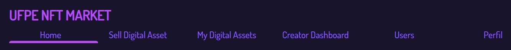
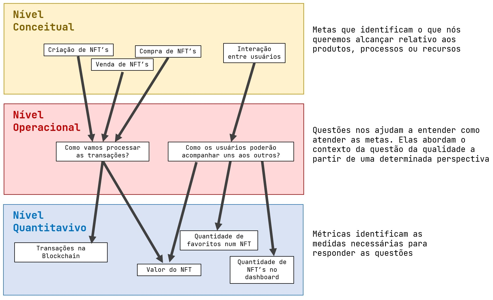
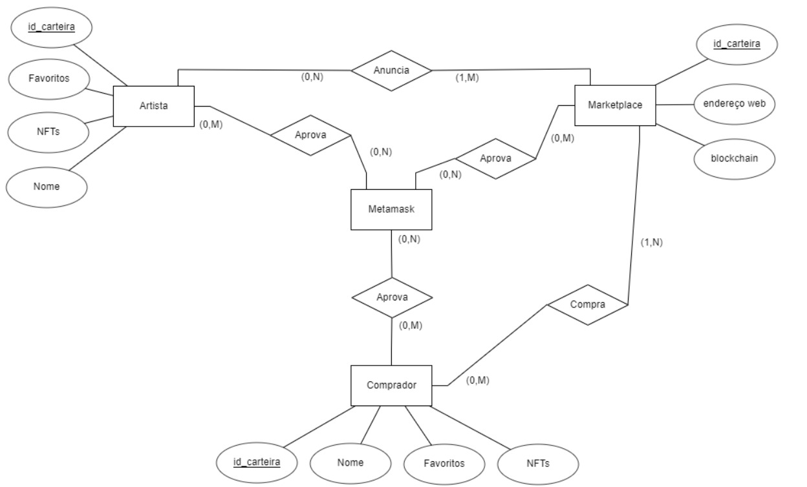
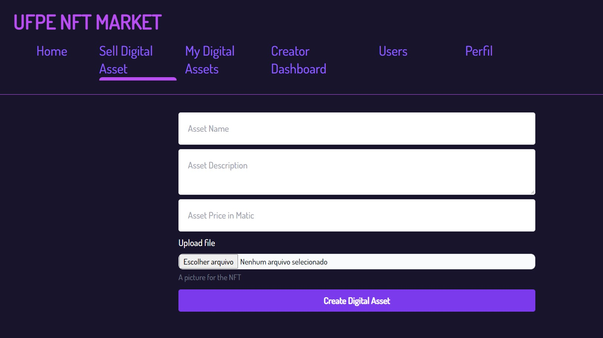
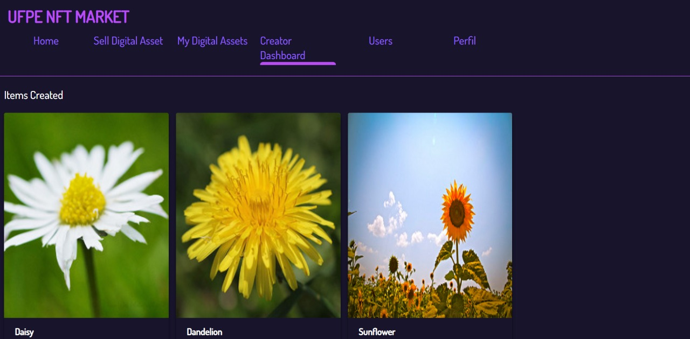
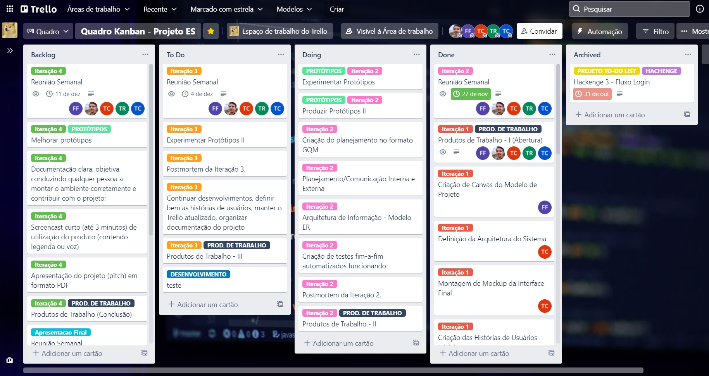

# UFPE NFT Market 

## Iteração 2	




### IF977- Engenharia de Software - Equipe 01

- Franklin Amaral Nunes dos Santos Filho - @fansf
- Gustavo Prazeres Paz do Nascimento - @gppn
- Thales Brederodes Montarroyos Candido - @tbmc
- Thiago Conte Rocha - @tcr2
- Thiago de Holanda Carvalho - @thc

------

## Criação do planejamento no formato GQM (Goal Question Metric) 📑




## Criação de Planejamento da Comunicação Interna 📢

link pro anexo

------

## Modelo ER do Sistema 🔡



------

## Desenvolvimento de Histórias de Usuários mais detalhadas

```
Como usuário do sistema, eu gostaria de favoritar um NFT para que eu possa acompanhar seu valor e para comprá-la posteriormente.
```

```
Como usuário do sistema, eu gostaria de visualizar os demais usuários para segui-los e ver seu dashboard com seus NFT's.
```

```
Como usuário do sistema, eu gostaria de de que os demais usuários consigam me encontrar para me seguir e visualizar meu dashboard com minhas NFT's.
```

```
Como usuário do sistema, eu gostaria de alterar meu nome e minha foto de perfil para que os demais usuários possam encontrar meu perfil.
```


## Desenvolvimento de Testes  Fim-a-Fim

- Teste onde deve ser criado um NFT e executada a venda do mesmo

```javascript
describe("NFTMarket", function() {
  it("Deve criar e executar uma venda", async function() {
    const Market = await ethers.getContractFactory("NFTMarket")
    const market = await Market.deploy()
    await market.deployed()
    const marketAddress = market.address

    const NFT = await ethers.getContractFactory("NFT")
    const nft = await NFT.deploy(marketAddress)
    await nft.deployed()
    const nftContractAddress = nft.address

    let listingPrice = await market.getListingPrice()
    listingPrice = listingPrice.toString()

    const auctionPrice = ethers.utils.parseUnits('1', 'ether')

    await nft.createToken("https://www.mytokenlocation.com")
    await nft.createToken("https://www.mytokenlocation2.com")
  
    await market.createMarketItem(nftContractAddress, 1, auctionPrice, { value: listingPrice })
    await market.createMarketItem(nftContractAddress, 2, auctionPrice, { value: listingPrice })
    
    const [_, buyerAddress] = await ethers.getSigners()

    await market.connect(buyerAddress).createMarketSale(nftContractAddress, 1, { value: auctionPrice})

    items = await market.fetchMarketItems()
    items = await Promise.all(items.map(async i => {
      const tokenUri = await nft.tokenURI(i.tokenId)
      let item = {
        price: i.price.toString(),
        tokenId: i.tokenId.toString(),
        seller: i.seller,
        owner: i.owner,
        tokenUri
      }
      return item
    }))
    console.log('items: ', items)
  })
})
```


## Deploy de Histórias de Usuários da Iteração 1

```
Como artista, eu gostaria de criar um NFT com minha arte para que ela seja única e tenha um valor digital insubstituível.
```

```
Como artista, eu gostaria de criar um NFT com minha arte para que ela possa ser vendida a outros usuários integrantes da blockchain e eu consiga ter um lucro com meu trabalho desenvolvido.
```

```
Como investidor, eu gostaria de comprar e vender NFT's de forma estratégica visando o retorno do capital investido.
```



```
Como como colecionador de NFTs, eu gostaria de ter a posse de itens raros em meu dashboard para ganhar status e reconhecimento de outros colecionadores.
```



------

## Metodologia Utilizada

- #### Versionamento do Código por meio do Git e [repositório público no GitHub](https://github.com/ThalesBMC/NFTMarketplace)

- #### Controle de atividades planejadas, em progresso e realizadas por meio de [Quadro Kanban no Trello](https://trello.com/b/JU5srUvv/quadro-kanban-projeto-es):

  

  

- #### Realização de reuniões semanais por entre os integrantes da equipe utilizando o Discord

  - *Ata de reunião da Iteração 02 - realizada no dia 27/11/2021*

    Disponível no Trello: https://trello.com/c/uuUkKCNk/29-reuni%C3%A3o-semanal

    

- #### Apresentar ao professor orientador relatórios semanais do andamento das atividades em desenvolvimento

------

# Postmorten da Iteração 2📜

| Início da Iteração | Término da iteração |
| ------------------ | ------------------- |
| 25/11/2021         | 01/12/2021          |

## O que estava planejado

| Atividade                                                | Atribuição |
| -------------------------------------------------------- | ---------- |
| Criação do planejamento no formato GQM                   | `@thc`     |
| Criação de Planejamento da Comunicação Interna           | `@fansf`   |
| Modelo ER do Sistema                                     | `@trc2`    |
| Desenvolvimento de Histórias de Usuários mais detalhadas | `@gppn`    |
| Desenvolvimento de Testes  Fim-a-Fim                     | `@tbmc`    |
| Deploy de Histórias de Usuários da Iteração 1            | `@tbmc`    |
| Reunião semanal todos os sábados no Discord da Equipe    | `@todos`   |

## O que foi e o que não foi feito

* Todas as atividades planejadas para essa iteração foram realizadas!

## Planejado para próxima iteração

- Definir mais três e últimas histórias de usuário;
- Finalizar desenvolvimentos;
- Atualizar o Issue Tracker (Trello) atualizado;
- Organizar e detalhar a documentação do projeto;
- Planejamento do Pitch e organização para a Apresentação Final;
- Realização do Postmortem da Iteração 3.

### Lições aprendidas

* O que é um planejamento GQM;
* Como criar um planejamento de comunicação interna;
* Melhores práticas para se representar um modelo ER de um sistema;
* Planejamento TDD e criação de Teste Fim a Fim automatizado;
* Organização do trabalho para que todos da equipe pudessem colaborar com as entregas.

------

##### *IF977- Engenharia de Software - Equipe 01 - 2021.1- Iteração 02*

