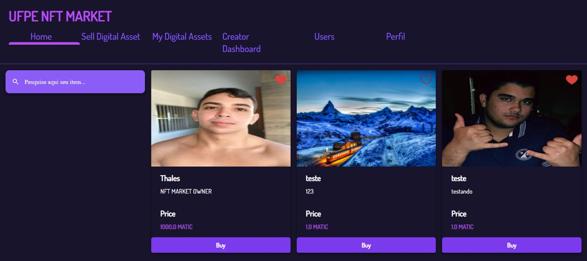
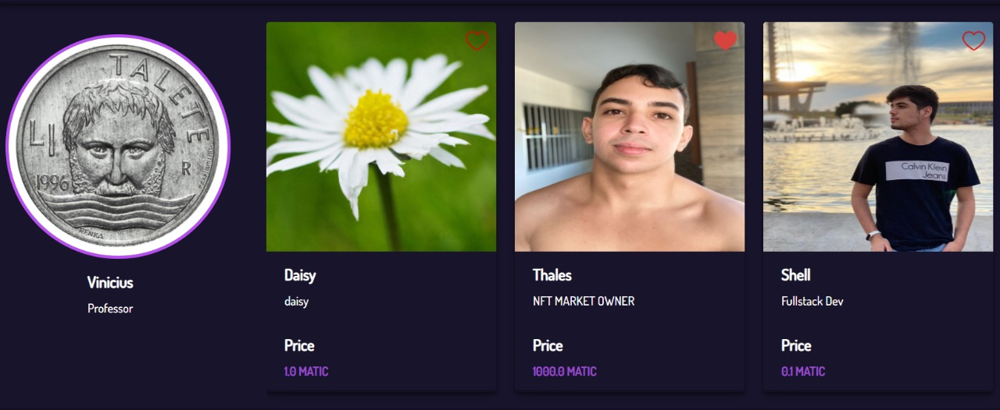
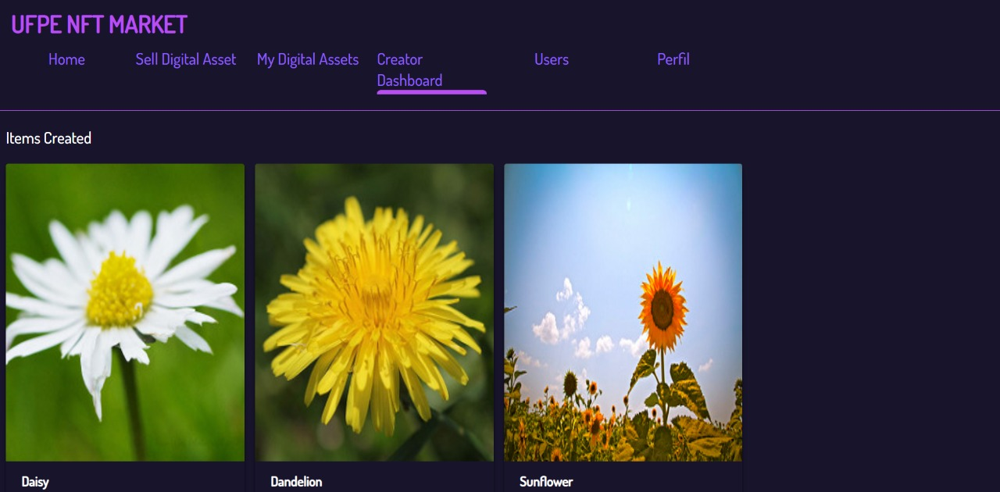
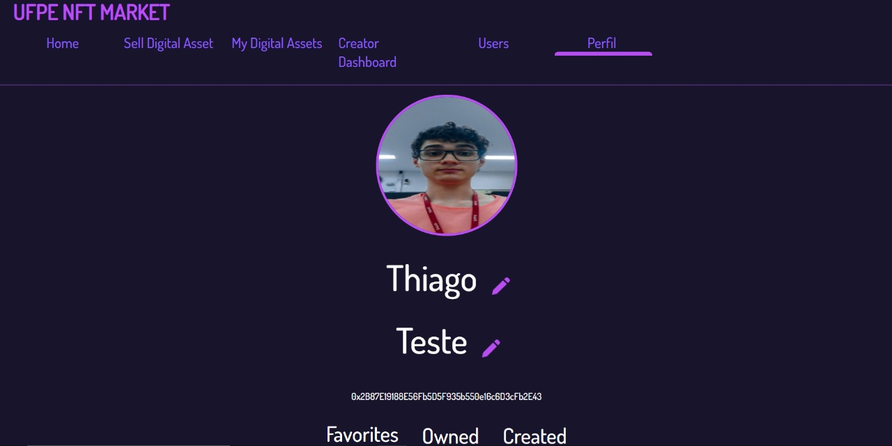
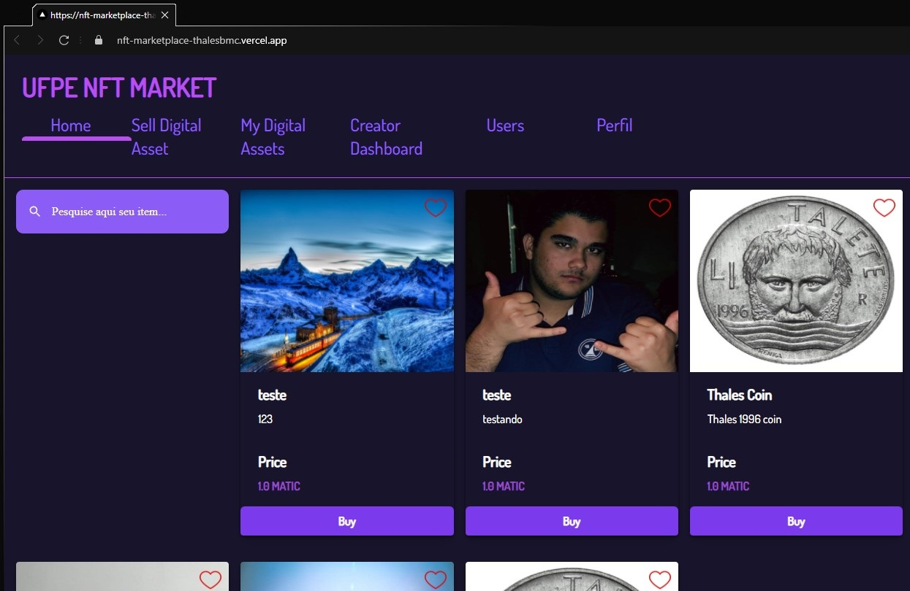
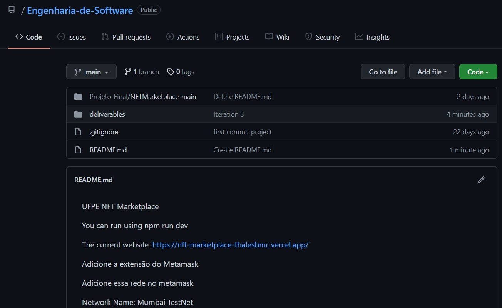
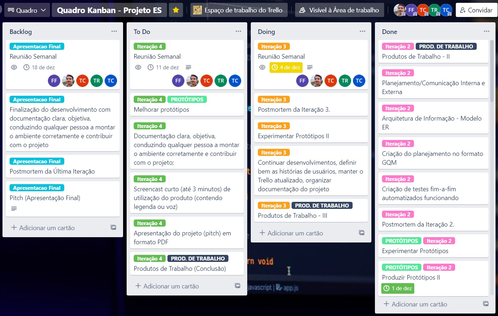

# UFPE NFT Marketplace

## Iteração 3

### IF977- Engenharia de Software - Equipe 01

- Franklin Amaral Nunes dos Santos Filho - @fansf
- Gustavo Prazeres Paz do Nascimento - @gppn
- Thales Brederodes Montarroyos Candido - @tbmc
- Thiago Conte Rocha - @tcr2
- Thiago de Holanda Carvalho - @thc

---

&nbsp;

## Deploy de Histórias de Usuário da Iteração 02

&nbsp;

```
Como usuário do sistema, eu gostaria de favoritar um NFT para que eu possa acompanhar seu valor e para comprá-la posteriormente.
```



&nbsp;

```
Como usuário do sistema, eu gostaria de visualizar os demais usuários para segui-los e ver seu dashboard com seus NFT's.
```



&nbsp;

```
Como usuário do sistema, eu gostaria de de que os demais usuários consigam me encontrar para me seguir e visualizar meu dashboard com minhas NFT's.
```



&nbsp;

```
Como usuário do sistema, eu gostaria de alterar meu nome, minha foto de perfil e a descrição do meu perfil para que os demais usuários possam encontrar meu perfil.
```



---

&nbsp;

## Finalização e Deploy do desenvolvimento por meio do Vercel 👩🏻‍💻

https://nft-marketplace-thalesbmc.vercel.app/


&nbsp;

---

## Organização dos repositórios e Documentação do projeto



&nbsp;

---

## Preparação de artefatos e Planejamento para a Apresentação Final

- Screencast de utilização do produto
- Definição dos pontos para a apresentação final
- Descrição detalhada do processo de trabalho da equipe
- Como a comunicação foi gerenciada
- Ferramentas utilizadas
- Levantamento de todas as práticas ágeis adotadas
- Criação de apresentação no Google Presentations

&nbsp;

---

## Metodologia Utilizada

- #### Versionamento do Código por meio do Git e [repositório público no GitHub](https://github.com/ThalesBMC/NFTMarketplace)
- #### Controle de atividades planejadas, em progresso e realizadas por meio de [Quadro Kanban no Trello](https://trello.com/b/JU5srUvv/quadro-kanban-projeto-es):

  

- #### Realização de reuniões semanais por entre os integrantes da equipe utilizando o Discord

  - _Ata de reunião para a Iteração 03 - realizada no dia 11/12/2021_

    Disponível no Trello: https://trello.com/c/U1hIvGRI/31-reuni%C3%A3o-semanal

- #### Apresentar ao professor orientador relatórios semanais do andamento das atividades em desenvolvimento
  &nbsp;
  &nbsp;

---

# Postmorten da Iteração 3📜

| Início da Iteração | Término da iteração |
| ------------------ | ------------------- |
| 02/12/2021         | 08/12/2021          |

## O que estava planejado

| Atividade                                         | Atribuição |
| ------------------------------------------------- | ---------- |
| Finalizar desenvolvimentos e inserir documentação | `@tbmc`    |
| Manter o Issue Tracker (Trello) atualizado        | `@todos`   |
| Planejamento para a Apresentação Final            | `@todos`   |
| Realização do Postmortem da Iteração 3            | `@gppn`    |
| Ajustes no botão de realizar venda                | `@tcr2`    |

&nbsp;

## O que foi e o que não foi feito

- Todas as atividades planejadas para essa iteração foram realizadas!

&nbsp;

## Planejado para última iteração

- Entrega do Screencast de utilização do produto
- Criação de apresentação no Google Presentations e entrega em PDF
- Entrega de Documentação clara, objetiva, conduzindo qualquer pessoa a montar o ambiente corretamente e contribuir com o projeto;
- Descrição detalhada do processo de trabalho, ferramentas e comunicação da equipe
- Criação do Postmortem da Última iteração 4.

&nbsp;

---

##### _IF977- Engenharia de Software - Equipe 01 - 2021.1- Iteração 02_
