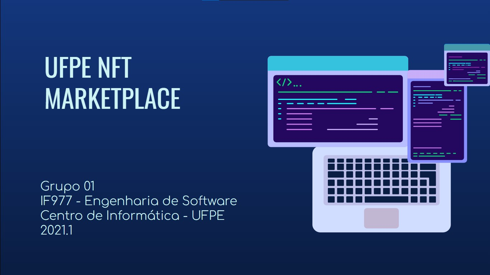

# UFPE NFT Marketplace

## Iteração 4 - Final

### IF977- Engenharia de Software - Equipe 01

- Franklin Amaral Nunes dos Santos Filho - @fansf
- Gustavo Prazeres Paz do Nascimento - @gppn
- Thales Brederodes Montarroyos Candido - @tbmc
- Thiago Conte Rocha - @tcr2
- Thiago de Holanda Carvalho - @thc

---

## Organização dos repositórios, finalização do projeto e apresentação final

- Screencast de utilização do produto
- Definição dos pontos para a apresentação final
- Descrição detalhada do processo de trabalho da equipe
- Como a comunicação foi gerenciada
- Ferramentas utilizadas
- Levantamento de todas as práticas ágeis adotadas
- Criação de apresentação no Google Presentations

[Link para apresentação do projeto (pitch) em formato PDF](https://github.com/ThalesBMC/Engenharia-de-Software/blob/main/deliverables/Itera%C3%A7%C3%A3o%2004/UFPE%20NFT%20Marketplace%20-%20Apresenta%C3%A7%C3%A3o%20Final.pptx.pdf)

---

&nbsp;
## Metodologia Utilizada

- #### Versionamento do Código por meio do Git e [repositório público no GitHub](https://github.com/ThalesBMC/NFTMarketplace)
- #### Controle de atividades planejadas, em progresso e realizadas por meio de [Quadro Kanban no Trello](https://trello.com/b/JU5srUvv/quadro-kanban-projeto-es):

- #### Realização de reuniões semanais por entre os integrantes da equipe utilizando o Discord

  - _Ata de reunião para a Iteração 04 e apresentação final - realizada no dia 18/12/2021_

    Disponível no Trello: https://trello.com/c/vzVMAhKL/32-reuni%C3%A3o-semanal

  &nbsp;
---

# Postmorten da Iteração 4📜

| Início da Iteração | Término da iteração |
| ------------------ | ------------------- |
| 08/12/2021         | 22/12/2021          |

## O que estava planejado

| Atividade                                         | Atribuição |
| ------------------------------------------------- | ---------- |
| Finalização da Apresentação Final            | `@todos`   |
| Realização do Postmortem da Iteração Final            | `@todos`    |

&nbsp;

## O que foi e o que não foi feito

- Todas as atividades planejadas para essa iteração foram realizadas!

&nbsp;
---

##### _IF977- Engenharia de Software - Equipe 01 - 2021.1- Iteração Final_
